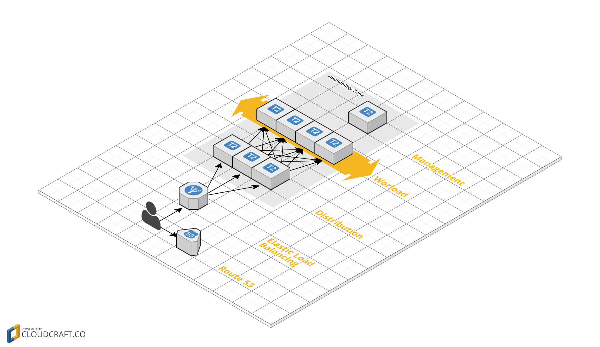

What?
=====

Terraform and Puppet code to build a single demo AZ docker compute setup with
traefik and an ELB

The AZ has:

  * 3 x Traefik + Consul servers per region - not ideal as you'd rather have
    a seperate consul cluster made up of an odd amount of nodes
  * 4 x Docker compute nodes with consul client and registrator

Additionally there is a Puppet Master running MCollective setup with Choria

Any containers that start with exposed ports will immediately appear and be
load balanced by the traefik cluster

